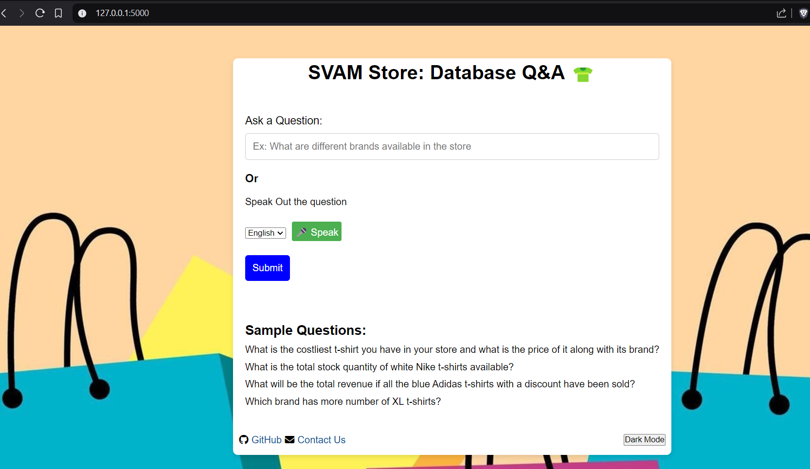
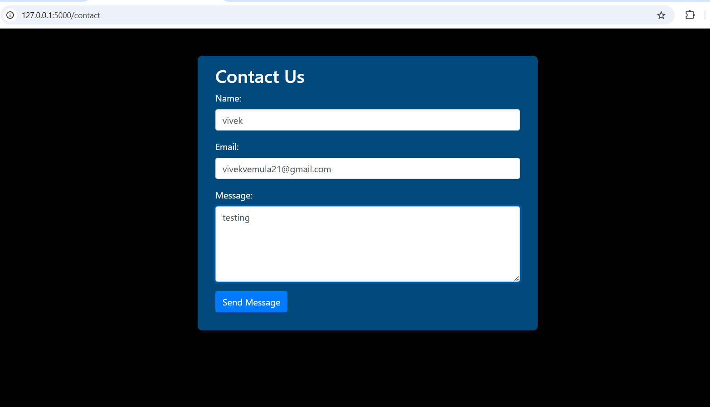
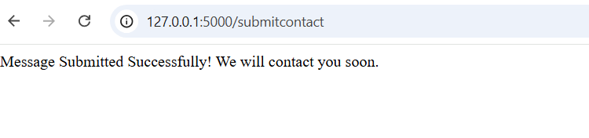

### About
Natural language is converted into sql queries using Gemini llm and langchain which is a framework to create applications upon llm.
This llm will have access to our database and converts the question to sql query and returns the answer. We need to add complex questions in few shot learning where llm
can't understand any complex questions given by the user.So, it uses semanticsimilarity examples to learn from it.

Home page:

 

### To run Flask
> flask run  
### To run streamlit
> streamlit run main.py  

Used local database , the sql query file is given at `database/sql.sql`  

###  Requirements
To install all the dependencies run
> pip install -r requirements.txt

### Deployment 
-> Deployed on flask  
-> `app.py` is the main server which handles all the request. Go to `\app.py` to see  
-> Used local sql database  
-> Used `easygoogletranslate` for tranlation of different languages  

### Feedback
-> Added contactus page, where the user can share his issue or problem  
-> Used `MySQLdb` python library to automatically store the users response (name,email,message) into the local sql database  

